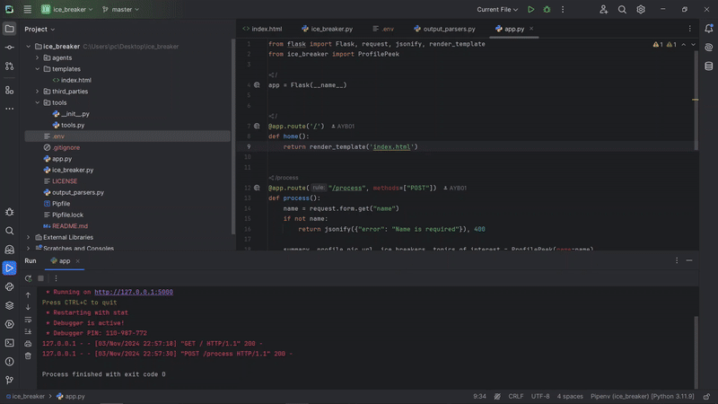

# Profile Peek Web Application

## Project Overview

The Profile Peek application is a Flask-based web app that generates a profile summary, ice breakers, and topics of interest for a given person’s name by querying LinkedIn and other data sources. This app is designed for professionals looking to gather introductory information about contacts, leveraging language models (LLMs) like OpenAI's ChatGPT or Google’s Gemini to generate insights from LinkedIn data.

<p align="center">
  
</p>

### Features
- **LinkedIn Profile Scraping**: Retrieves information from LinkedIn profiles to create summaries and conversational prompts.
- **LLM Integration**: Uses OpenAI’s ChatGPT, Google’s Gemini, or other LLMs via LangChain for generating a profile summary.
- **Social Media Search**: Uses Tavily API for social media profile searches.
- **Generated Details**: Provides a summary, profile picture URL, two interesting facts, ice breakers, and topics of interest.

## Installation and Setup

To set up this project, you’ll need Python (version 3.8 or higher), and you can use either `pipenv` or another virtual environment tool like `venv`. Follow the steps below:

### 1. Clone the Repository

```bash
git clone https://github.com/yourusername/profile-peek-app.git
cd profile-peek-app
```

2. Set Up a Virtual Environment
Using pipenv (Recommended)

```bash
pipenv install
pipenv shell
```
3. Install Required Dependencies
Create a requirements.txt file or use the one below to install all necessary packages:
```bash
Flask==2.2.2
requests==2.28.1
langchain==0.0.112  # Core LangChain library for handling prompts and chains
langchain-core  # LangChain submodules for prompts and output parsing
pydantic==1.10.2  # For creating structured data models
python-dotenv==0.20.0  # For handling .env files and loading environment variables
openai  # Optional: If you use OpenAI’s ChatGPT model
```
4. Environment Variables
```
Create a .env file in the root directory to store your API keys. This project requires the following environment variables:
# API key for Proxycurl for LinkedIn profile scraping
PROXYCURL_API_KEY=your_proxycurl_api_key_here

# API key for Tavily to search social media profiles
TAVILY_API_KEY=your_tavily_api_key_here

# API key for GROQ, used if you have additional data requirements
GROQ_API_KEY=your_groq_api_key_here

# Google API key, if using Google's LLMs like Gemini
GOOGLE_API_KEY=your_google_api_key_here

# LangChain API key for orchestrating prompt handling
LANGCHAIN_API_KEY=your_langchain_api_key_here

# Enable LangChain tracing for debugging (set to 'true' for detailed logs)
LANGCHAIN_TRACING_V2=true

# Set the name of your LangChain project (optional but helpful for organization)
LANGCHAIN_PROJECT="Your Project Name"
```
Langsmith Integration :
Langsmith is a powerful tool for monitoring LangChain workflows. Use Langsmith to track the execution and performance of your LangChain models, gather detailed analytics on your workflows, and ensure optimal performance. It helps you monitor the entire process, from prompt creation to model outputs, providing valuable insights into the efficiency and accuracy of your system. By integrating Langsmith, you can easily debug issues, optimize performance, and gain a deeper understanding of how your models are performing in real-time.

5. Choose Your LLM
The app integrates with large language models (LLMs) through LangChain:

OpenAI's ChatGPT: Requires an OpenAI API key.
Google's Gemini: Requires a Google API key.
Make sure to add these API keys to your .env file as shown above.

6. Run the Application
After completing the setup, you can start the Flask app with:
```bash
flask run
```

The application will be available at http://127.0.0.1:5000.

Usage
Access the Home Page: Go to http://127.0.0.1:5000.
Enter a Name: Input the person’s name in the search form.
Submit: Get the profile summary, picture URL, ice breakers, and topics of interest.

##Project Structure
```bash
project-directory/
│
├── app.py                 # Main Flask application file
├── ice_breaker.py         # Contains the ProfilePeek function for generating profile summaries
├── requirements.txt       # Project dependencies
├── templates/
│   └── index.html         # HTML template for the home page
├── .env                   # Environment variables for API keys (not included in version control)
└── README.md              # Project documentation
```

API Documentation
This app leverages several APIs for profile scraping, search, and natural language processing:

Proxycurl: Provides LinkedIn data scraping capabilities to generate profile summaries.
Tavily: Finds social media profiles based on name searches.
LangChain: Coordinates LLM processing with prompt templates and outputs.
Ensure each of these API services is properly set up and API keys are available.

Contributing
Contributions are welcome! Please open an issue or submit a pull request for any improvements.
